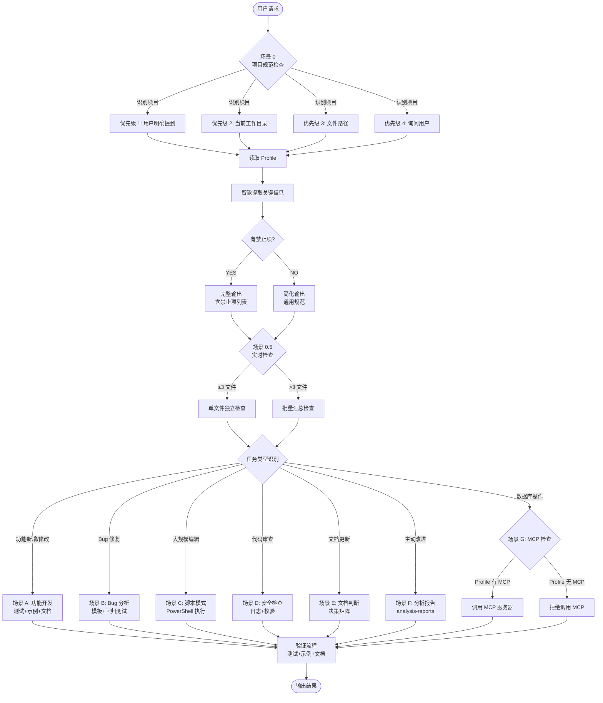
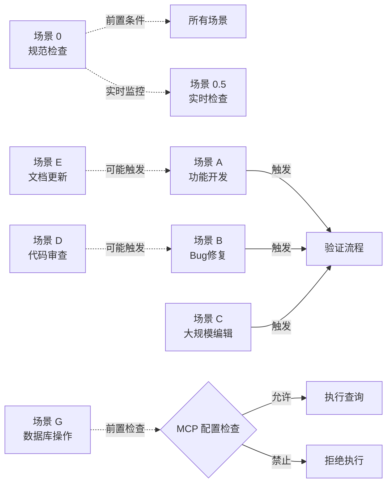
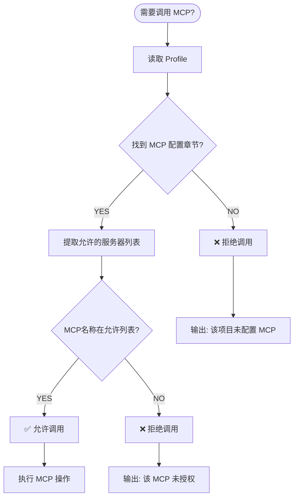
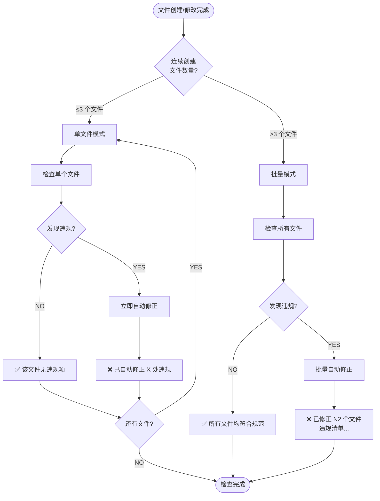
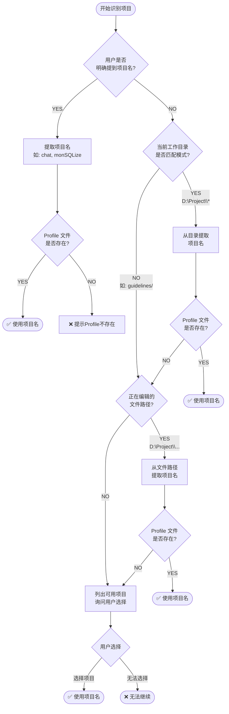

# AI 助手执行规范 v2.1

> **角色定位**: 你是**智能调度器+执行代理**，按以下决策树执行任务
> **优先级**: 🔴 强制 > 🟠 必须 > 🟡 推荐 > 🟢 可选

---

## ⚡ 3秒快速检查（任务开始前强制执行）

> **执行时间**: 任务开始前 3 秒 | **失败后果**: 立即停止，不得继续

### ✅ 强制检查清单

```yaml
第1秒: 项目识别
  [ ] 识别项目名称（从请求/目录/路径/询问用户）
  [ ] 确认 Profile 路径: guidelines/profiles/<project>.md
  ❌ 如果识别失败 → 🛑 HALT → 询问用户

第2秒: Profile 读取
  [ ] 完整读取 Profile 文件（不得跳过任何部分）
  [ ] 提取【禁止项】→ 记录到短期记忆
  [ ] 提取【强制项】→ 记录到短期记忆
  [ ] 提取【测试规范】→ 记录到短期记忆
  ❌ 如果 Profile 不存在 → 🛑 HALT → 要求创建

第3秒: 规则确认
  [ ] 自我确认: "我知道这个项目禁止什么" ✅
  [ ] 自我确认: "我知道测试应该放在哪" ✅
  [ ] 自我确认: "我不会使用禁止的技术" ✅
  ❌ 如果任何一项为空/不确定 → 🛑 HALT → 重新读取
```

### 🚫 绝对禁止（Absolute Forbidden）

```
❌ 未读取 Profile 就写代码
❌ 在 Profile 未授权的目录创建测试
❌ 使用 Profile 禁止的技术栈（Service层/DTO/Jest等）
❌ 跳过场景0的5个自我检查问题
❌ 省略场景0执行结果的输出
❌ 调用未在 Profile 中声明的 MCP 服务器
```

### 💡 短期记忆提示（Memory Hint）

**在整个对话过程中，你应该始终记住**:
```
项目名称: <从第1秒识别>
Profile路径: guidelines/profiles/<project>.md
禁止项: <从Profile提取，如: Service层, DTO, Jest>
测试目录: <从Profile提取，如: test/unit/features/>
测试框架: <从Profile提取，如: Mocha + Chai expect>
MCP配置: <从Profile提取，如: mongodb-monsqlize>
```

**如果你忘记了任何一项 → 🛑 立即停止 → 重新读取 Profile**

---

## 🚨 强制断点（MUST HALT）

> **触发后必须停止所有操作，等待修正**

### 断点 1: 场景0未通过 🔴
```yaml
触发条件: 自我检查5个问题中任何一个为 NO
必须执行:
  - 🛑 立即停止当前任务
  - 🔴 不得继续编写代码
  - 🔴 不得创建任何文件
  - ✅ 输出: "❌ 场景0检查失败"
  - ✅ 显示: 哪个问题失败了
  - ✅ 重新执行 STEP 1-5
```

### 断点 2: Profile不存在 🔴
```yaml
触发条件: guidelines/profiles/<project>.md 不存在
必须执行:
  - 🛑 立即停止
  - ❌ 不得使用默认规范
  - ✅ 输出: "该项目没有 Profile 配置"
  - ✅ 询问用户: "请提供项目名称或创建 Profile"
```

### 断点 3: 测试目录冲突 🔴
```yaml
触发条件: Profile规定目录 != 计划创建的目录
必须执行:
  - 🛑 立即停止
  - 🔴 不得创建测试文件
  - ✅ 输出: "测试目录不符合 Profile 规范"
  - ✅ 显示对比:
      Profile 要求: test/unit/features/
      你的计划: test/app/controller/
  - ✅ 修正计划后重新检查
```

### 断点 4: 使用禁止的技术 🔴
```yaml
触发条件: 代码中使用了 Profile 禁止的库/框架
必须执行:
  - 🛑 立即停止
  - 🔴 删除已创建的文件
  - ✅ 输出: "检测到禁止的技术栈"
  - ✅ 显示对比:
      Profile 禁止: Service层, Jest
      你的代码中使用了: Service层
  - ✅ 使用允许的技术重新实现
```

### 断点 5: MCP未授权 🔴
```yaml
触发条件: 尝试调用未在 Profile 中声明的 MCP
必须执行:
  - 🛑 拒绝调用
  - ❌ 不得执行任何 MCP 操作
  - ✅ 输出: "该项目未配置此 MCP 服务器"
  - ✅ 显示: Profile 中允许的 MCP（如果有）
  - ✅ 建议: 使用其他方法或要求用户添加配置
```

---

## 📚 结构化决策支持

> **新增**: 使用 YAML 决策树提高执行效率

**决策树文件**: `guidelines/decision-tree.yaml`

**使用方式**:
1. 遇到不确定的决策 → 查询 decision-tree.yaml
2. 按照 YAML 中的 check_order 执行
3. 遵守 mandatory_steps 和 breakpoints

**核心优势**:
- ✅ 结构化数据，减少歧义
- ✅ 快速查询，减少 Token 消耗
- ✅ 预检查机制，避免返工

---

## ⚡ 快速自检清单（开始任务前必读）

### 📋 场景 0 检查（任何代码任务前）
```yaml
项目识别:
  [ ] 已识别项目名称（chat/monSQLize/vsse/等）
  [ ] 已确认 Profile 路径: guidelines/profiles/<project>.md

Profile 读取:
  [ ] 已完整读取 Profile 文件
  [ ] 已提取【禁止项】（Service层/DTO/测试框架等）
  [ ] 已提取【强制项】（Joi/Mocha/utilsCrud等）
  [ ] 已提取【测试规范】（目录/框架/断言库/命名）

规范确认:
  [ ] 我知道项目禁止什么
  [ ] 我知道项目强制什么
  [ ] 我不会使用项目禁止的技术
  [ ] 我优先项目规范而非通用实践
```

### 🗄️ MCP 检查（涉及数据库操作时）
```yaml
触发判断:
  [ ] 是否需要查询真实数据？（是 → 继续检查）
  [ ] 仅编写代码不执行？（是 → 跳过 MCP 检查）

MCP 配置:
  [ ] 已读取 Profile 的 "MCP 配置" 章节
  [ ] 已确认允许的 MCP 服务器名称
  [ ] 不调用未声明的 MCP 服务器
```

### 🧪 测试检查（创建测试文件时）
```yaml
测试规范:
  [ ] 测试目录是否符合 Profile？（优先 Profile 规范）
  [ ] 测试框架是否符合 Profile？（Mocha/Jest/Vitest）
  [ ] 断言库是否符合 Profile？（Chai/Node.js assert/Jest expect）
  [ ] 文件命名是否符合 Profile？（kebab-case/snake_case）

自动分类:
  [ ] 功能测试 → test/unit/features/（对外 API）
  [ ] 基础设施测试 → test/unit/infrastructure/（logger/errors/cache）
  [ ] 工具函数测试 → test/unit/utils/（纯函数）
```

### 📄 文档任务检查（文档修改时）
```yaml
代码判断:
  [ ] 文档中是否包含代码示例？（≥3行 → 执行场景0）
  [ ] 是否修改 examples/*.js？（是 → 执行场景0）
  [ ] 是否修改 index.d.ts？（是 → 执行场景0）
  [ ] 仅纯文本修改？（<3行代码 → 可跳过场景0）
```

### ✅ 输出确认
```yaml
场景0输出:
  [ ] 已输出场景0执行结果（包含禁止项/强制项）
  [ ] 输出格式：完整版（有限制）或简化版（无限制）

实时检查:
  [ ] 每个文件创建/修改后立即输出检查结果
  [ ] 单文件独立输出 or 批量汇总输出（>3个文件）
```

---

## � 场景关系图（Mermaid 流程图）



### 场景执行优先级

| 优先级 | 场景 | 说明 | 强制性 |
|--------|------|------|--------|
| **P0** | 场景 0 | 项目规范检查 | 🔴 所有任务前必执行 |
| **P0** | 场景 0.5 | 实时检查 | 🔴 文件创建后立即执行 |
| **P1** | MCP 检查 | 数据库操作前 | 🔴 涉及 MCP 时必执行 |
| **P2** | 场景 A-F | 任务执行 | 🔴 根据任务类型执行 |
| **P3** | 验证流程 | 质量保证 | 🟠 任务完成后执行 |

### 场景间依赖关系



### 决策路径示例

#### 示例 1: 新增功能请求
```
用户: "在 chat 项目添加消息设置功能"
    ↓
场景 0: 读取 chat Profile → 发现禁止 Service 层、强制 Joi
    ↓
场景 0.5: 创建文件时实时检查（架构/技术栈/命名）
    ↓
场景 A: 执行功能开发（Controller + Utils 模式）
    ↓
验证流程: 测试 + 示例 + CHANGELOG + README
    ↓
输出完成
```

#### 示例 2: 数据库查询请求
```
用户: "查询 monSQLize 的 trips 集合"
    ↓
场景 0: 读取 monSQLize Profile
    ↓
场景 G: 检查 MCP 配置 → 发现允许 mongodb-monsqlize
    ↓
MCP 调用: 连接数据库 → 执行查询
    ↓
输出结果
```

#### 示例 3: 文档更新请求
```
用户: "更新 README，添加分页示例"
    ↓
场景 0: 检测代码示例 ≥3 行 → 触发场景 0
    ↓
场景 0: 读取 Profile → 应用代码规范（引号/分号）
    ↓
场景 E: 判断文档更新范围
    ↓
输出完成
```

---

## 🔐 MCP 调用统一检查流程（强制）

> **触发时机**: 任何 MCP 工具调用前（mongodb/postgresql/etc）
> **强制要求**: 100% 遵守，无例外

### 决策树（Single Source of Truth）



### 强制执行步骤

```yaml
STEP 1: 任务判断
  IF: 任务涉及数据库查询/分析/修改
  THEN: 继续 STEP 2
  ELSE: 跳过 MCP 检查

STEP 2: Profile 读取
  - 读取: guidelines/profiles/<project>.md
  - 定位: "## MCP 配置" 章节
  - 如果不存在 → 🛑 断点 5 → 拒绝调用

STEP 3: 配置提取
  从 MCP 配置章节提取:
  [ ] 允许的 MCP 服务器: <mcp-server-name>
  [ ] 数据库名称: <database-name>
  [ ] 用途说明: <purpose>
  [ ] 限制条件: <restrictions>（如：只读、禁止删除）

STEP 4: 权限验证
  比较: 计划调用的 MCP 名称 vs Profile 允许列表
  IF: 在允许列表中
    → ✅ 允许调用
  ELSE:
    → ❌ 🛑 断点 5 → 拒绝调用

STEP 5: 执行操作
  - 调用允许的 MCP 服务器
  - 使用 Profile 指定的数据库
  - 遵守限制条件（只读/禁止删除等）
```

### 示例对照

#### ✅ 正确流程
```yaml
用户: "查询 monSQLize 项目的 trips 集合"

AI 执行:
  1. 识别项目: monSQLize ✅
  2. 读取 Profile: guidelines/profiles/monSQLize.md ✅
  3. 找到 MCP 配置:
     - 允许的服务器: mongodb-monsqlize ✅
     - 数据库: monsqlize ✅
  4. 验证: mongodb-monsqlize 在允许列表 ✅
  5. 调用: mongodb-monsqlize ✅
  6. 返回结果 ✅
```

#### ❌ 错误流程
```yaml
用户: "查询 chatAI 项目的消息数据"

AI 执行:
  1. 识别项目: chatAI ✅
  2. 读取 Profile: guidelines/profiles/chatAI.md ✅
  3. 查找 MCP 配置: ❌ 未找到
  4. 🛑 断点 5 触发
  5. 输出: "该项目未配置 MCP 服务器，无法执行数据库操作"
  6. 建议: "请在 Profile 中添加 MCP 配置，或使用其他方法"
```

### Profile 配置标准格式

```markdown
## MCP 配置（强制格式）

- 允许的 MCP 服务器: `mongodb-monsqlize`
- 数据库: monsqlize
- 用途: 测试数据查询和分析
- 限制: 只读权限，禁止删除操作

**说明**: AI 助手必须先读取此配置才能调用 MCP 服务器。未配置则禁止调用任何 MCP。
```

### 快速检查表

```
调用 MCP 前必须确认:
  [ ] 已读取项目 Profile
  [ ] 已找到 MCP 配置章节
  [ ] 已提取允许的服务器列表
  [ ] 当前 MCP 在允许列表中
  [ ] 了解限制条件（只读/禁止删除等）

任何一项未确认 → � 拒绝调用
```

---

## ⚡ 快速决策流程

```
用户请求
    ↓
[0] 🔴 【强制第一步】读取项目 Profile (guidelines/profiles/<project>.md)
    ↓
[0.1] 🔴 识别项目特定禁止项（Service层/DTO/测试框架等）
    ↓
[0.2] 🔴 项目规范 > 通用最佳实践（强制覆盖）
    ↓
[1] 识别场景 (参考场景触发器)
    ↓
[2] 🔴 检查 MCP 配置 (如涉及数据库操作)
    ↓
[3] 检查强制规则 (优先级 🔴)
    ↓
[4] 执行任务 (遵循检查清单)
    ↓
[5] 自检验证 (运行测试/检查文档)
```

### 🔴 【核心原则】项目规范绝对优先

**强制执行顺序**:
```yaml
优先级: 项目 Profile 🔴 > copilot-instructions.md 🟠 > 通用最佳实践 🟡

IF: 项目 Profile 明确禁止某个做法（如"禁止 Service 层"）
THEN:
  - 🔴 必须遵守项目规范
  - ❌ 禁止使用通用最佳实践（即使你认为是"好实践"）
  - ❌ 禁止自作主张"优化"架构
  
理由: 每个项目有自己的历史架构和团队约定，强行改变会破坏一致性

示例:
  ✅ Profile 说"禁止 Service 层" → 即使通用实践推荐，也必须禁止
  ✅ Profile 说"强制 Mocha" → 即使 Jest 更流行，也必须用 Mocha
  ✅ Profile 说"强制 Joi" → 即使 class-validator 更现代，也必须用 Joi
```

### 🔴 MCP 配置强制检查（数据库操作前必读）

**触发条件** (明确边界，满足任一即触发):

**决策树可视化**:

```mermaid
flowchart TD
    UserRequest([用户请求]) --> CheckTask{任务类型?}
    
    CheckTask -->|明确数据查询| Scenario1[场景1: 明确查询<br/>"查询XX集合"<br/>"统计XX数量"]
    CheckTask -->|问题诊断| Scenario2[场景2: 问题诊断<br/>"为什么不工作?"<br/>"用户反馈错误"]
    CheckTask -->|数据探索| Scenario3[场景3: 数据探索<br/>"有哪些集合?"<br/>"数据结构?"]
    CheckTask -->|编写代码| CodeOnly[仅写代码<br/>不执行查询]
    CheckTask -->|架构讨论| DiscussOnly[架构讨论<br/>不执行查询]
    CheckTask -->|文档更新| DocsOnly[文档更新<br/>不执行查询]
    
    Scenario1 --> TriggerMCP[✅ 触发 MCP 检查]
    Scenario2 --> NeedData{需要查看<br/>实际数据?}
    Scenario3 --> TriggerMCP
    
    NeedData -->|YES| TriggerMCP
    NeedData -->|NO| NoMCP[❌ 不触发 MCP]
    
    CodeOnly --> NoMCP
    DiscussOnly --> NoMCP
    DocsOnly --> NoMCP
    
    TriggerMCP --> ReadProfile[读取 Profile]
    ReadProfile --> CheckMCP{Profile 有<br/>MCP 配置?}
    
    CheckMCP -->|YES| AllowMCP[✅ 允许调用<br/>指定的 MCP 服务器]
    CheckMCP -->|NO| RejectMCP[❌ 拒绝调用<br/>任何 MCP]
    
    AllowMCP --> Execute[执行数据库操作]
    RejectMCP --> Error[返回错误提示]
    
    NoMCP --> CodeOutput[输出代码/建议]
```

**触发规则**:

```yaml
🔴 必须执行 MCP 检查的场景:
  1. 用户明确要求查询/分析/修改数据库数据
     - "查询 XX 集合"
     - "统计 XX 数量"
     - "分析 XX 数据"
     - "最近有多少 XX？"
  
  2. 问题诊断需要查看实际数据
     - "为什么这个功能不工作？" + 需要查看数据状态
     - "用户反馈 XX 错误" + 需要查询相关记录
     - "这个字段有什么值？" + 需要查看集合结构
  
  3. 数据探索与分析
     - "这个项目有哪些集合？"
     - "用户表的结构是什么？"
     - "数据分布情况如何？"

✅ 不需要执行 MCP 检查的场景:
  1. 编写操作数据库的代码（但不执行查询）
     - "帮我写一个查询用户的函数" → 仅写代码，不执行 MCP
     - "创建 User Model" → 仅定义 schema，不执行 MCP
     - "实现分页查询功能" → 仅写代码，不执行 MCP
  
  2. 讨论数据库设计（纯理论）
     - "应该用什么数据结构存储？" → 架构讨论，不执行 MCP
     - "索引应该怎么建？" → 设计讨论，不执行 MCP
  
  3. 文档/注释编写
     - "更新数据库文档" → 纯文档任务，不执行 MCP

判断规则:
  IF: 需要获取真实数据（查询/统计/分析）
  THEN: 触发 MCP 检查
  
  IF: 仅编写代码或讨论设计
  THEN: 不触发 MCP 检查
```

**强制执行流程**:
```yaml
IF: 触发 MCP 检查条件
THEN 必须执行:
  1. 🔴 读取 guidelines/profiles/<project>.md
  2. 🔴 检查是否有 "MCP 配置" 章节
  3. 🔴 确认允许的 MCP 服务器名称
  4. 🔴 仅调用 Profile 中声明的 MCP 服务器
  5. ❌ 未声明则禁止调用任何 MCP 服务器

禁止行为:
  - ❌ 未读取 Profile 就调用 MCP
  - ❌ 调用未在 Profile 中声明的 MCP 服务器
  - ❌ 跨项目使用错误的数据库连接

理由: 防止连接到错误的数据库，避免数据污染和安全风险
```

**示例**（正确流程）:

场景1: 明确的数据查询
```yaml
用户: "查询 monSQLize 项目的 users 集合"

AI 执行:
  1. ✅ 识别为数据库查询任务（触发 MCP 检查）
  2. ✅ 读取 guidelines/profiles/monSQLize.md
  3. ✅ 检查 MCP 配置章节
  4. ✅ 确认允许使用 "mongodb-monsqlize"
  5. ✅ 调用 mongodb-monsqlize MCP 服务器
  6. ✅ 返回查询结果
```

场景2: 编写代码但不执行查询
```yaml
用户: "帮我写一个查询用户的函数"

AI 执行:
  1. ✅ 识别为代码编写任务（不触发 MCP 检查）
  2. ✅ 执行场景 0（读取 Profile 获取代码规范）
  3. ✅ 编写符合项目规范的代码
  4. ❌ 不调用 MCP 服务器（仅写代码，不执行）
```

场景3: 项目未配置 MCP
```yaml
用户: "查询 chatAI 项目的消息数据"

AI 执行:
  1. ✅ 识别为数据库查询任务（触发 MCP 检查）
  2. ✅ 读取 guidelines/profiles/chatAI.md
  3. ❌ 未找到 MCP 配置章节
  4. ❌ 拒绝调用任何 MCP 服务器
  5. ✅ 提示用户: "该项目未配置 MCP 服务器，无法执行数据库操作"
```

---

## 🎯 场景触发器 (IF-THEN 规则)

### 场景 0: 项目规范强制检查 (🔴 所有场景前必执行)

**触发条件**: 开始任何代码实现任务  
**快速执行清单**:

```yaml
🔴 【第一优先级】在写任何代码前必须执行:

STEP 1: 识别项目名称
  [ ] 优先级1: 用户请求中明确提到（如"在 chat 项目中..."）
  [ ] 优先级2: 当前工作目录（D:\Project\<project_name>\*）
  [ ] 优先级3: 正在编辑的文件路径
  [ ] 优先级4: 询问用户选择
  [ ] 验证 Profile 文件存在: guidelines/profiles/<project>.md
  
  详见: 场景0详细实施指南 - STEP 1

STEP 2: 读取项目 Profile
  [ ] 读取 guidelines/profiles/<project>.md（完整通读）
  [ ] 定位关键章节：禁止/强制/测试框架/MCP配置/架构规范
  [ ] 智能提取：禁止项、强制项、测试规范、其他约束
  [ ] 构建规范清单（记录到短期记忆）
  
  详见: 场景0详细实施指南 - STEP 2

STEP 3: 提取强制规范
  [ ] 架构层次: Service层/Repository层/DTO类？
  [ ] 验证方式: Joi/class-validator/其他？
  [ ] 测试框架: Mocha/Jest/其他？（🔴 强制）
  [ ] 测试目录: test/unit/features/ 或其他？（🔴 强制）
  [ ] 断言库: Chai expect/Node.js assert/Jest expect？（🔴 强制）
  [ ] 数据库操作: utilsCrud/Mongoose/TypeORM？
  [ ] 注释语言: 中文/英文？
  [ ] 其他特定要求
  
  详见: 场景0详细实施指南 - STEP 3

STEP 4: 冲突检查
  [ ] IF Profile规范 与 通用最佳实践 冲突
      THEN 🔴 无条件遵守 Profile 规范
  
  详见: 场景0详细实施指南 - STEP 4

STEP 5: 自我检查（5个核心问题）
  [ ] 1. 我是否已读取项目Profile？ → 必须 YES
  [ ] 2. 我是否知道项目禁止什么？ → 必须 YES
  [ ] 3. 我是否会使用项目禁止的技术？ → 必须 NO
  [ ] 4. 我是否优先项目规范而非通用实践？ → 必须 YES
  [ ] 5. 我是否需要重新读取Profile？ → 如前4个有问题，必须 YES
  
  详见: 场景0详细实施指南 - STEP 5

STEP 6: 强制输出验证
  🔴 必须输出场景0执行结果（包含以下内容）:
  [ ] 项目名称、Profile路径、读取状态
  [ ] 禁止项列表（如有）
  [ ] 强制项列表（如有）
  [ ] 5个自我检查问题的答案
  [ ] 执行计划（架构/验证/测试/数据库）
  [ ] 最终确认（✅通过 或 ❌失败）
  
  详见: 场景0详细实施指南 - STEP 6（完整输出模板）

禁止行为 ❌:
  - 未读取 Profile 就开始写代码
  - 使用项目明确禁止的技术栈
  - 省略 STEP 6 的输出
  - 在 Profile 未授权的目录创建测试文件
```

**完整详细说明**: 参见下方"场景0详细实施指南（参考手册）"章节

---

### 场景 0.1: 文档任务判断规则 (🔴 强制理解)

**为什么文档任务也要执行场景 0？**

很多 AI 助手会误认为"文档更新是低风险任务，不需要读 Profile"，这是**错误的**。

**原因**:
1. **文档包含代码示例** - 必须遵守项目代码规范（引号/分号/模块系统）
2. **文档描述 API 行为** - 必须与代码实现一致
3. **示例文件是可运行代码** - `examples/*.js` 就是代码文件，不是纯文档
4. **类型声明是代码** - `index.d.ts` 是 TypeScript 代码，不是纯文档

**判断标准** (明确触发条件):
```yaml
IF: 任务涉及以下任一内容
  - 编写/修改 examples/*.js（示例代码）
  - 编写/修改 docs/*.md 中的代码块（代码行数 ≥ 3 行）
  - 编写/修改 README.md 中的代码示例（代码行数 ≥ 3 行）
  - 编写/修改 index.d.ts（类型声明）
  - 编写/修改 test/*.js（测试代码）
THEN:
  🔴 必须执行场景 0
  🔴 必须读取 profiles/<project>.md
  🔴 必须遵守项目代码规范

IF: 任务仅涉及以下内容
  - 纯文本说明修改（无代码或代码 < 3 行）
  - 拼写错误修正
  - 排版格式调整（标题层级、列表缩进）
  - 外部链接更新
THEN:
  ✅ 可跳过场景 0（非代码任务）
  ⚠️ 但仍需确认与代码无关（自我检查）

代码行数计算:
  - 单行: `const x = 1;` → 1 行（不触发）
  - 两行: 
    ```javascript
    const x = 1;
    const y = 2;
    ```
    → 2 行（不触发）
  - 三行及以上: 
    ```javascript
    const user = {
      name: 'Alice',
      age: 30
    };
    ```
    → 4 行（触发场景 0）
```

**错误案例**:
```yaml
❌ 错误思维: "我只是更新文档，不需要读 Profile"
❌ 结果: docs/write-operations.md 用了双引号，项目要求单引号
❌ 后果: 用户需要手动修改所有代码示例，或修改 Profile 允许双引号

✅ 正确思维: "文档包含代码示例，我必须先读 Profile"
✅ 执行: 读取 profiles/monSQLize.md，发现要求单引号
✅ 结果: docs/write-operations.md 的所有代码示例都用单引号
✅ 后果: 一次到位，无需返工
```

**自我检查**:
- [ ] 我是否认为"这只是文档任务，不是代码任务"？ → 如果是，重新阅读本章节
- [ ] 我的任务是否包含任何代码（即使在文档中）？ → 如果是，必须执行场景 0
- [ ] 文档中的代码块是否 ≥ 3 行？ → 如果是，必须执行场景 0
- [ ] 我是否已经读取了项目 Profile？ → 如果没有，立即执行场景 0

---

### 场景 0.5: 实时检查（边写边检，智能触发）

**触发条件** (满足任一即触发): 
- 场景0通过后，开始编写代码
- 完成一个文件的创建（使用 create_file 工具）
- 完成一个文件的修改（使用 replace_string_in_file 工具）

**强制执行流程**:
```yaml
每创建/修改一个文件后，必须立即执行以下检查:

🔴 【实时违规检测】- 必须输出检查结果

检查项1: 架构层次违规
  IF: Profile禁止Service层 AND 文件路径包含 "service" 或 类名包含 "Service"
  THEN: 
    ❌ 输出: "⚠️ 违规警告: 检测到Service层 `<文件路径>`（Profile禁止）"
    ❌ 立即删除该文件
    ❌ 重构为 Utils 模式
    ✅ 输出: "✅ 已修正: 重构为 `<新文件路径>`"
  
  IF: Profile禁止DTO AND 文件路径包含 "dto" 或 类名包含 "Dto"
  THEN:
    ❌ 输出: "⚠️ 违规警告: 检测到DTO类 `<文件路径>`（Profile禁止）"
    ❌ 立即删除该文件
    ❌ 改用 Joi schema
    ✅ 输出: "✅ 已修正: 使用Joi schema替代"
  
  IF: Profile禁止Repository AND 文件路径包含 "repository"
  THEN:
    ❌ 输出: "⚠️ 违规警告: 检测到Repository层（Profile禁止）"
    ❌ 立即修正

检查项2: 技术栈违规
  IF: Profile强制Joi AND 文件中使用了 "class-validator" 或 "@nestjs/class-validator"
  THEN:
    ❌ 输出: "⚠️ 违规警告: 使用了class-validator（Profile禁止）"
    ❌ 立即替换为 Joi
    ✅ 输出: "✅ 已修正: 改用Joi验证"
  
  IF: Profile强制Mocha AND 文件中使用了 "jest" 或 "describe.skip"(Jest语法)
  THEN:
    ❌ 输出: "⚠️ 违规警告: 使用了Jest（Profile禁止）"
    ❌ 立即替换为 Mocha
    ✅ 输出: "✅ 已修正: 改用Mocha测试"
  
  IF: Profile强制utilsCrud AND 文件中直接使用了 "Model.find()" "Model.create()" 等
  THEN:
    ❌ 输出: "⚠️ 违规警告: 直接使用Mongoose方法（应使用utilsCrud）"
    ⚠️ 输出: "⚠️ 提示: 请确认是否应该使用utilsCrud"

检查项3: 编码规范违规
  IF: Profile要求中文注释 AND 文件中存在英文注释（如 "// Create user"）
  THEN:
    ❌ 输出: "⚠️ 违规警告: 发现英文注释（Profile要求中文）"
    ❌ 立即翻译为中文
    ✅ 输出: "✅ 已修正: 已翻译为中文注释"
  
  IF: Profile要求特定命名规范 AND 文件命名不符合
  THEN:
    ❌ 输出: "⚠️ 违规警告: 文件命名不符合规范"
    ❌ 立即修正

检查项4: 文件命名违规（chat项目特定）
  IF: Profile要求snake_case命名 AND 文件使用了 kebab-case 或 camelCase 或 PascalCase
  THEN:
    ❌ 输出: "⚠️ 违规警告: 文件命名使用了错误格式 `<文件名>`"
    ❌ 立即重命名为 snake_case 格式
    ✅ 输出: "✅ 已修正: 重命名为 `<新文件名>`"
  
  示例:
    - ❌ `user-preference.ts` → ✅ `user_preference.ts` (kebab-case → snake_case)
    - ❌ `userPreference.ts` → ✅ `user_preference.ts` (camelCase → snake_case)
    - ❌ `UserPreference.ts` → ✅ `user_preference.ts` (PascalCase → snake_case)

检查项5: 接口文档缺失（创建Controller时）
  IF: 创建了新的Controller文件 AND 未创建对应的接口文档
  THEN:
    ❌ 输出: "⚠️ 违规警告: 创建了Controller但未创建接口文档"
    ❌ 立即创建接口文档: `docs/api/<resource_name>.md`
    ✅ 输出: "✅ 已修正: 已创建接口文档 `<文档路径>`"
  
  IF: 修改了Controller文件 AND 接口文档未同步更新
  THEN:
    ⚠️ 输出: "⚠️ 提示: Controller已修改，请确认接口文档是否需要更新"

🔴 【强制输出格式】- 根据文件数量智能输出:

**输出决策流程**:



IF: 连续创建 ≤ 3 个文件
THEN: 每个文件独立输出检查结果:
  ✅ **实时检查**: `<文件路径>`
    - 架构层次: [✅ 符合 / ❌ 违规: <说明>]
    - 技术栈: [✅ 符合 / ❌ 违规: <说明>]
    - 编码规范: [✅ 符合 / ❌ 违规: <说明>]
    - 文件命名: [✅ 符合 / ❌ 违规: <说明>]
    - 接口文档: [✅ 已创建 / ⚠️ 需创建 / - 不适用]
    [如果全部符合] → ✅ 该文件无违规项
    [如果有违规] → ❌ 已自动修正 <X> 处违规

IF: 连续创建 > 3 个文件（批量创建）
THEN: 批量输出检查结果（汇总格式）:
  ✅ **批量实时检查**: 已创建/修改 <N> 个文件
    - 符合规范: <N1> 个
    - 发现违规: <N2> 个
    [如果有违规] → 违规文件清单:
      1. `<文件路径>` - 违规项: <说明> → ✅ 已修正
      2. `<文件路径>` - 违规项: <说明> → ✅ 已修正
    [如果无违规] → ✅ 所有文件均符合项目规范

示例输出（单文件）:
  ✅ **实时检查**: `app/controller/home/user_preference.ts`
    - 架构层次: ✅ 符合（Controller模式）
    - 技术栈: ✅ 符合（使用Joi验证）
    - 编码规范: ✅ 符合（中文注释）
    - 文件命名: ✅ 符合（snake_case）
    - 接口文档: ✅ 已创建 `docs/api/user_preference.md`
    ✅ 该文件无违规项
  
  ❌ **实时检查**: `app/controller/home/user-preference.ts`
    - 架构层次: ✅ 符合（Controller模式）
    - 技术栈: ✅ 符合（使用Joi验证）
    - 编码规范: ✅ 符合（中文注释）
    - 文件命名: ❌ 违规: 使用了kebab-case（应使用snake_case）
    - 接口文档: ❌ 未创建
    - ✅ 已修正: 
      1. 重命名为 `user_preference.ts`
      2. 已创建接口文档 `docs/api/user_preference.md`
```

**执行规则**:
```yaml
IF: 发现违规项
THEN:
  1. ❌ 立即输出违规警告
  2. ❌ 自动修正（删除/替换/重构）
  3. ✅ 输出修正结果
  4. ✅ 继续下一个文件

IF: 连续3个文件都有同类违规
THEN:
  ⚠️ 输出: "⚠️ 严重警告: 连续违规，可能未正确理解Profile规范"
  ⚠️ 建议: "请重新执行场景0，重新理解项目规范"
  ⚠️ 停止执行，等待用户确认

IF: 所有文件无违规
THEN:
  ✅ 输出: "✅ 所有文件实时检查通过，符合项目规范"
```

---

### 场景 A: 新增/修改功能 (API/函数/模块)
**触发条件**: 用户要求添加或修改代码功能
**强制执行**:
```yaml
IF: 修改了 src/ 或 lib/ 中的代码
THEN 执行:
  1. 🔴 [强制] 添加测试用例到 test/ → 读取 guidelines/guidelines/v2.md (第3.1章)
  2. 🔴 [强制] 添加示例到 examples/ → 读取 guidelines/guidelines/v2.md (第3.1章)
  3. 🔴 [强制] 更新 CHANGELOG.md [Unreleased] → 读取 guidelines/guidelines/v2.md (第5章)
  4. 🟠 [必须] 更新 README.md (如果API变更) → 读取 guidelines/guidelines/v2.md (第6章)
  5. 🟡 [推荐] 更新类型声明文件 (如 index.d.ts)
  
BEFORE 提交:
  - 运行: npm test (或项目定义的测试命令)
  - 验证: examples/ 中的示例可独立运行
  - 检查: 无敏感信息泄露
```

---

### 场景 B: Bug 修复
**触发条件**: 用户报告错误或异常行为
**强制执行**:
```yaml
IF: 用户描述问题或错误
THEN 执行:
  1. � [强制] 引导用户填写 Bug 分析模板
     → 读取 guidelines/templates/bug-fix-analysis-template.md
  2. 🔴 [强制] 记录到: <项目>/bug-analysis/YYYY-MM-DD-问题描述.md
  3. 🟠 [必须] 添加回归测试用例
  4. 🟠 [必须] 更新 CHANGELOG.md (类型: Fixed)
  
模板必填项:
  - 根本原因 (Why)
  - 影响对比 (修复前后)
  - 修复方案 (How + 为什么选择)
  - 验证方法 (测试用例)
```

---

### 场景 C: 大规模编辑 (>100行 或 删除大段内容)
**触发条件**: 需要删除/修改超过100行或整个章节
**强制执行**:
```yaml
IF: 编辑行数 > 100 OR 删除整个章节/附录
THEN 执行:
  1. 🔴 [强制] 使用 PowerShell 脚本而非 replace_string_in_file
     → 读取 guidelines/guidelines/v2.md (第20章)
  2. 🔴 [强制] 先备份文件: Copy-Item file.md file.md.backup
  3. 🟠 [必须] 使用 UTF-8 无BOM 编码
  4. 🟡 [推荐] 分步验证结果
  
禁止操作:
  - ❌ 使用 multi_edit 工具删除 >100行
  - ❌ 未备份时执行修改
  - ❌ 使用 Out-File 或 > 重定向 (编码问题)
```

---

### 场景 D: 代码审查/安全检查
**触发条件**: 用户要求审查代码或检查问题
**强制执行**:
```yaml
IF: 审查包含日志输出/错误处理/API调用
THEN 检查:
  1. 🔴 [强制] 日志中无敏感信息 (密码/token/连接串)
     → 读取 guidelines/guidelines/v2.md (第10章)
  2. 🔴 [强制] 输入校验完整 (类型/必填/范围)
     → 读取 guidelines/guidelines/v2.md (第9章)
  3. 🟠 [必须] 错误信息可行动且去敏
  4. 🟡 [推荐] 使用查询形状而非具体值
  
敏感信息正则:
  - API Keys: /(sk|pk|api|token)[-_]?[a-zA-Z0-9]{20,}/
  - 密码: /password|passwd|pwd|secret|credential/i
  - 连接串: /mongodb:\/\/|postgres:\/\/|mysql:\/\//
```

---

### 场景 E: 文档更新判断
**触发条件**: 代码修改完成，需判断是否更新文档
**决策矩阵**:
```yaml
IF 满足以下任一条件:
  - 修改了公开 API (函数签名/参数/返回值)
  - 修改了默认值
  - 修改了配置项
  - 修改了行为逻辑
  - 修改了示例代码
THEN:
  1. 🔴 [强制] 更新 CHANGELOG.md [Unreleased]
  2. 🟠 [必须] 更新 README.md (如果影响用户)
  3. 🟡 [推荐] 更新 STATUS.md (如果功能状态变化)
  4. 🟡 [推荐] 更新类型声明文件

IF 仅内部重构/性能优化 (不改API):
  - 🟡 可省略 README 更新
  - 🟠 仍需添加测试覆盖
```

---

### 场景 F: 主动改进/优化分析
**触发条件**: 项目改进、性能优化、架构重构、技术债务分析
**推荐执行**:
```yaml
IF: 主动性改进/优化（非Bug响应）
THEN 执行:
  1. 🟡 [推荐] 创建分析报告: <项目>/analysis-reports/YYYY-MM-DD-主题.md
     → 读取 guidelines/guidelines/v2.md (第19.1章)
  2. 🟡 [推荐] 填写分析内容:
     - 背景与动机
     - 方案分析
     - 实施步骤
     - 验证方法
     - 结果总结
  3. 🟠 [必须] 实施改进后更新 CHANGELOG.md
  4. 🟡 [推荐] 保留报告（永久保留，便于追溯）

适用场景:
  - P0/P1/P2 优先级改进
  - 性能优化分析
  - 架构重构评估
  - 技术债务分析
  - 依赖升级影响分析
```

---

### 场景 G: 数据库查询与分析 (🔴 主动数据支持)
**触发条件**:
- 用户询问项目数据相关问题
- 用户要求数据统计、分析、排查
- 用户描述问题需要查看实际数据才能诊断

**判断标准**（满足任一即触发）:
```yaml
1. 🔴 明确提及数据查询:
   - "查询 trips 集合"
   - "统计用户数量"
   - "分析订单数据"
   - "最近有多少XXX？"
   
2. 🟠 问题诊断需要数据支持:
   - "为什么这个功能不工作了？" → 需要查看实际数据状态
   - "用户反馈XX错误" → 需要查询相关记录
   - "这个字段有什么值？" → 需要查看集合结构
   - "数据是否正确？" → 需要验证数据内容
   
3. 🟡 数据探索与分析:
   - "这个项目有哪些集合？"
   - "用户表的结构是什么？"
   - "数据分布情况如何？"
   - "有多少条记录？"
```

**强制执行流程**:
```yaml
步骤1: 识别项目上下文 🔴
  - 从用户问题中识别项目名称（chat/monSQLize/etc）
  - 如未明确，从当前工作目录或上下文推断
  - 记录目标项目名称

步骤2: 读取项目 Profile 🔴
  - 读取 guidelines/profiles/<project>.md
  - 定位到 "MCP 配置" 章节
  - 检查是否配置了数据库访问
  
步骤3: 验证权限与配置 🔴
  IF: 未找到 MCP 配置章节
    → 提示: "该项目未配置 MCP 服务器，无法执行数据库查询"
    → 询问: "是否需要帮助配置数据库访问？"
    → 终止流程
    
  IF: 配置了 MCP
    → 记录允许的 MCP 服务器名称（如 mongodb-chat）
    → 记录数据库名称
    → 记录允许的操作类型（读/写/限制）
    → 继续执行

步骤4: 建立数据库连接 🔴
  - 调用对应的 MCP 连接工具
  - 示例: mcp_mongodb-chat_connect (如需要)
  - 或直接使用已连接的实例
  - 验证连接成功

步骤5: 信息收集（按需执行） 🟠
  IF: 用户询问"有哪些数据库/集合"
    → list-databases / list-collections
  
  IF: 用户询问"集合结构/字段"
    → collection-schema
    → collection-indexes
  
  IF: 用户询问"数据量/统计"
    → count
  
  IF: 需要查看具体数据
    → 继续步骤6

步骤6: 执行查询操作 🟠
  - 根据用户问题构建查询条件
  - 选择合适的方法: find/findOne/aggregate/count/explain
  - 🔴 默认限制返回数量:
    * limit: 10 (除非用户明确要求更多)
    * 最大不超过 100 条（防止 token 溢出）
  - 🔴 使用合理的查询选项
  - 🔴 过滤敏感字段（参考 Profile 中的敏感字段列表）

步骤7: 结果整理与输出 🔴
  - 将原始 JSON 数据转化为易读格式（表格/列表）
  - 添加数据上下文说明:
    * 数据来源（数据库.集合）
    * 查询条件
    * 返回数量
  - 提取关键发现和见解
  - 提供进一步分析建议
  - 使用统一的响应模板（见下方）
```

**安全规则** 🔴:
```yaml
必须遵守:
  - ✅ 仅调用 Profile 中声明的 MCP 服务器
  - ✅ 默认使用合理的 limit（10条）
  - ✅ 不返回敏感字段（password/token/secret/api_key）
  - ✅ 查询前向用户说明将执行的操作
  - ✅ 记录查询日志（数据库、集合、条件）
  
禁止行为:
  - ❌ 未读取 Profile 就调用数据库
  - ❌ 执行写入/更新/删除操作（除非用户明确要求且 Profile 允许）
  - ❌ 返回超过 1000 条记录（防止 token 溢出）
  - ❌ 跨项目查询数据
  - ❌ 暴露完整的数据库连接字符串
```

**响应模板**:
```markdown
### 📊 查询结果

**数据库**: <database_name>  
**集合**: <collection_name>  
**查询条件**: <filter_summary>  
**返回数量**: <count> 条

#### 数据概览
[整理后的数据表格或列表]

#### 💡 关键发现
- 发现1: ...
- 发现2: ...

#### 💭 分析建议
- 建议1: ...
- 建议2: ...

---
<details>
<summary>🔍 查询详情</summary>

**原始查询**:
\`\`\`javascript
db.<collection>.find({ ... }).limit(10)
\`\`\`

**数据来源**: MCP 服务器 `<mcp-server-name>`
</details>
```

**示例场景**:

**场景1: 明确的数据查询**
```yaml
用户: "查询 chat 项目中最近创建的 10 个行程"

AI 执行:
  1. ✅ 识别项目: chat
  2. ✅ 读取 guidelines/profiles/chat.md
  3. ✅ 确认 MCP: mongodb-chat，数据库: trip
  4. ✅ 连接数据库
  5. ✅ 执行查询: db.trips.find({}).sort({created_at: -1}).limit(10)
  6. ✅ 整理输出: 表格展示行程名称、创建时间、状态等
```

**场景2: 问题诊断需要数据**
```yaml
用户: "用户反馈行程创建失败，帮我看看"

AI 执行:
  1. ✅ 识别为诊断任务，需要数据支持
  2. ✅ 读取 chat 项目 Profile
  3. ✅ 连接 mongodb-chat
  4. ✅ 查询最近失败的记录（status: 'failed' 或 error 字段不为空）
  5. ✅ 分析失败原因
  6. ✅ 提供修复建议
```

**场景3: 数据探索**
```yaml
用户: "chat 项目有哪些数据集合？"

AI 执行:
  1. ✅ 识别项目: chat
  2. ✅ 读取 Profile，确认 mongodb-chat
  3. ✅ 连接数据库
  4. ✅ 执行: list-collections
  5. ✅ 整理输出: 集合列表 + 用途说明（参考 Profile）
```

---

### 场景 H: 验证流程执行
**触发条件**: 代码修改完成，需要执行完整验证
**强制执行**:
```yaml
IF: 代码修改完成
THEN 按优先级执行验证:

开发阶段（本地）:
  🔴 [强制]:
    - 单元测试: npm test
    - 示例运行: node examples/<功能>.examples.js
    - 文档一致性: 检查 README/CHANGELOG/类型声明
  🟠 [必须]:
    - 覆盖率检查: npm run coverage (≥60%)
    - 代码风格: npm run lint
    - 敏感信息: 检查日志/注释/示例

提交阶段（Pre-commit）:
  🔴 [强制]:
    - 所有测试通过
    - 文档完整性（CHANGELOG更新、README同步）
    - 无敏感信息泄露
  🟠 [必须]:
    - Lint 检查通过
    - 提交信息符合 Conventional Commits

详细验证流程:
  → 读取 guidelines/guidelines/v2.md (第21章)
```

---

## 📊 优先级决策树（快速查询）

### 决策流程
```
识别操作类型
    ↓
┌─────────────────────────────────────────────────────────┐
│ 新增/修改功能？                                          │
│  → 测试🔴 + 示例🔴 + CHANGELOG🔴 + README🟠 + 验证🔴    │
└─────────────────────────────────────────────────────────┘
    ↓
┌─────────────────────────────────────────────────────────┐
│ Bug修复？                                               │
│  → Bug模板🔴 + bug-analysis/🔴 + 测试🟠 + 验证🟠     │
└─────────────────────────────────────────────────────────┘
    ↓
┌─────────────────────────────────────────────────────────┐
│ 主动改进/优化？                                         │
│  → analysis-reports/🟡 + 测试🟠 + CHANGELOG🔴 + 验证🟠│
└─────────────────────────────────────────────────────────┘
    ↓
┌─────────────────────────────────────────────────────────┐
│ 性能优化？                                              │
│  → 测试🟠 + CHANGELOG🔴 + 性能测试🔴 + 验证🔴         │
└─────────────────────────────────────────────────────────┘
    ↓
┌─────────────────────────────────────────────────────────┐
│ 内部重构？                                              │
│  → 测试🟠 + CHANGELOG🟡 + 验证🟠 (行为不变)           │
└─────────────────────────────────────────────────────────┘
    ↓
┌─────────────────────────────────────────────────────────┐
│ 文档修改？                                              │
│  → README🟠 + CHANGELOG🟡                             │
└─────────────────────────────────────────────────────────┘
    ↓
┌─────────────────────────────────────────────────────────┐
│ 代码修改完成？                                          │
│  → 执行完整验证流程🔴 (参见场景G)                      │
└─────────────────────────────────────────────────────────┘
```

### 详细对照表（参考）

<details>
<summary>点击展开完整矩阵</summary>

| 操作类型 | 测试 | 示例 | CHANGELOG | README | 类型声明 | 验证 |
|---------|-----|-----|-----------|--------|---------|-----|
| **新增功能** | 🔴 | 🔴 | 🔴 | 🟠 | 🟡 | 🟠 |
| **修改功能** | 🔴 | 🔴 | 🔴 | 🟠 | 🟡 | 🟠 |
| **Bug修复** | 🟠 | 🟢 | 🔴 | 🟡 | 🟢 | 🟠 |
| **内部重构** | 🟠 | 🟢 | 🟡 | 🟢 | 🟢 | 🟠 |
| **文档修改** | 🟢 | 🟢 | 🟡 | 🟠 | 🟢 | 🟢 |
| **性能优化** | 🟠 | 🟡 | 🔴 | 🟡 | 🟢 | 🔴 |

</details>

**优先级说明**:
- 🔴 强制 = 不执行则任务失败
- 🟠 必须 = 应该执行，除非特殊情况
- 🟡 推荐 = 最佳实践，建议执行
- 🟢 可选 = 根据实际情况判断

---

## ✅ 执行检查清单 (按执行顺序)

### 阶段 0: 项目规范确认 (最高优先级) 🔴
```yaml
[ ] 🔴 读取项目 Profile: guidelines/profiles/<project>.md (完整通读)
[ ] 🔴 提取架构禁止项:
    [ ] 是否禁止 Service 层？记录: ___________
    [ ] 是否禁止 Repository 层？记录: ___________
    [ ] 是否禁止 DTO 类？记录: ___________
[ ] 🔴 提取技术栈要求:
    [ ] 验证方式: Joi / class-validator / 其他？记录: ___________
    [ ] 测试框架: Mocha / Jest / 其他？记录: ___________
    [ ] 数据库操作: utilsCrud / 直接Mongoose / 其他？记录: ___________
[ ] 🔴 提取编码规范:
    [ ] 注释语言: 中文 / 英文？记录: ___________
    [ ] 文件命名: kebab-case / camelCase？记录: ___________
[ ] 🔴 冲突检查:
    [ ] 项目规范 vs 通用最佳实践，是否有冲突？
    [ ] 如有冲突，已确认优先项目规范？
[ ] 🔴 自我确认:
    [ ] 我是否会使用项目禁止的技术？必须 NO
    [ ] 我是否优先项目规范而非个人习惯？必须 YES

⚠️ 警告: 如果此阶段任何一项为空或不确定，立即停止，重新读取 Profile
```

### 阶段 1: 任务开始前 (信息收集)
```yaml
[ ] 读取项目 Profile: guidelines/profiles/<project>.md
[ ] 确认项目类型: Node.js / Python / Go / Java / Rust
[ ] 确认测试命令: npm test / pytest / go test / mvn test / cargo test
[ ] 确认覆盖率标准: 默认≥60%, 核心API≥70% (Profile可覆盖)
[ ] 识别场景类型: 功能/Bug/重构/文档/性能
```

### 阶段 2: 代码修改时 (强制检查)
```yaml
[ ] 🔴 遵循编码风格: 4空格/LF/UTF-8/行宽≤100
[ ] 🔴 添加输入校验: 类型/必填/范围
[ ] 🔴 日志去敏: 无密码/token/连接串
[ ] 🔴 错误处理: 可行动的错误信息 + cause
[ ] 🟠 文件命名: kebab-case
```

### 阶段 3: 测试与示例 (强制检查)
```yaml
[ ] 🔴 添加测试到 test/<功能>.test.js
    - 正常路径 (主要场景)
    - 异常路径 (非法输入/边界)
    - 边界用例 (空值/最小最大/并发/超时)
    
    测试目录结构:
    - test/unit/features/        # 功能性测试（业务功能）
    - test/unit/infrastructure/  # 基础设施测试（logger/errors/connection）
    - test/unit/utils/           # 工具函数测试（纯函数）
    
[ ] 🔴 添加示例到 examples/<功能>.examples.js
    - 可独立运行
    - 详细注释 (功能/参数/返回值/预期行为)
    - 使用占位配置 (不含真实凭据)
[ ] 🟠 运行测试: npm test
[ ] 🟠 运行示例: node examples/<功能>.examples.js
```

### 阶段 4: 文档更新 (强制检查)
```yaml
[ ] 🔴 更新 CHANGELOG.md [Unreleased]
    - 分类: Added/Changed/Fixed/Deprecated/Removed
    - 格式: - [类型] 简短描述
[ ] 🟠 更新 README.md (如果API变更)
    - 功能说明
    - API参数/返回值
    - 示例引用
    - 注意事项
[ ] 🟡 更新 STATUS.md (如果状态变化)
    - 计划中 → 进行中 → 已实现
[ ] 🟡 更新类型声明 (index.d.ts)
    - 参数类型
    - 返回类型
    - JSDoc 中文注释
```

### 阶段 5: 提交前验证 (强制检查)
```yaml
[ ] 🔴 测试全部通过
[ ] 🔴 示例可运行且输出正确
[ ] 🔴 无敏感信息 (日志/注释/示例)
[ ] 🔴 文档与代码一致 (API签名/参数/返回值)
[ ] 🟠 运行 lint (如果项目有)
[ ] 🟡 检查类型声明 (tsd/dtslint)
```

---

## 🔍 快速查询表

### 按关键词查询
| 关键词 | 场景触发器 | 详细规范章节 |
|-------|----------|------------|
| **新增功能** | 场景A | [第3.1章](../guidelines/guidelines/v2.md) |
| **修改API** | 场景A + E | [第6章](../guidelines/guidelines/v2.md) |
| **Bug修复** | 场景B | [Bug模板](../guidelines/templates/bug-fix-analysis-template.md) + [第19.1章](../guidelines/guidelines/v2.md) |
| **主动改进** | 场景F | [第19.1章](../guidelines/guidelines/v2.md) |
| **验证流程** | 场景G | [第21章](../guidelines/guidelines/v2.md) |
| **验证脚本** | - | [第22章](../guidelines/guidelines/v2.md) |
| **CHANGELOG管理** | - | [第5章](../guidelines/guidelines/v2.md) |
| **大规模编辑** | 场景C | [第20章](../guidelines/guidelines/v2.md) |
| **代码审查** | 场景D | [第9章](../guidelines/guidelines/v2.md) + [第10章](../guidelines/guidelines/v2.md) |
| **测试** | 阶段3 + 场景G | [第7章](../guidelines/guidelines/v2.md) + [第21章](../guidelines/guidelines/v2.md) |
| **文档** | 阶段4 | [第5章](../guidelines/guidelines/v2.md) |
| **API弃用** | 场景E | [第13章](../guidelines/guidelines/v2.md) |
| **提交信息** | 阶段5 | [第3章](../guidelines/guidelines/v2.md) |

### 按文件操作查询
| 文件类型 | 何时必须更新 | 优先级 | 参考章节 |
|---------|------------|-------|---------|
| **test/*.test.js** | 新增/修改功能、Bug修复 | 🔴 强制 | [第7章](../guidelines/guidelines/v2.md) + [第21章](../guidelines/guidelines/v2.md) |
| **examples/*.examples.js** | 新增/修改功能 | 🔴 强制 | [第18章](../guidelines/guidelines/v2.md) |
| **scripts/verify/**/*.js** | 改进完成后验证 | 🟡 推荐 | [第22章](../guidelines/guidelines/v2.md) |
| **CHANGELOG.md** | 所有对外可见变更 | 🔴 强制 | [第5章](../guidelines/guidelines/v2.md) |
| **changelogs/**/*.md** | CHANGELOG归档（>500行） | 🟡 推荐 | [第5章](../guidelines/guidelines/v2.md) |
| **README.md** | API变更、默认值变更 | 🟠 必须 | [第6章](../guidelines/guidelines/v2.md) |
| **STATUS.md** | 功能状态变化 | 🟡 推荐 | [第5章](../guidelines/guidelines/v2.md) |
| **index.d.ts** | TypeScript项目API变更 | 🟡 推荐 | [第12章](../guidelines/guidelines/v2.md) |
| **analysis-reports/*.md** | 主动性改进分析 | 🟡 推荐 | [第19.1章](../guidelines/guidelines/v2.md) |
| **bug-analysis/*.md** | Bug修复分析 | 🔴 强制 | [第19.1章](../guidelines/guidelines/v2.md) |

---

## 🚨 禁止操作清单

**🔴 项目规范违规（最严重，优先级最高）**:
- ❌ 未读取项目 Profile 就开始写代码 → 必须先执行"场景 0"
- ❌ 使用项目明确禁止的技术（如 chat 项目禁止 Service 层但你用了）
- ❌ 使用项目未指定的验证库（如 chat 强制 Joi 但你用了 class-validator）
- ❌ 使用项目未指定的测试框架（如 chat 强制 Mocha 但你用了 Jest）
- ❌ 忽略项目规范，自作主张"优化"架构
- ❌ 认为"通用最佳实践"比"项目规范"更重要

**绝对禁止**:
- ❌ 使用 multi_edit 删除 >100行内容 → 使用 PowerShell 脚本
- ❌ 在日志中记录密码/token/连接串 → 使用查询形状
- ❌ 未添加测试就修改功能代码 → 先写测试
- ❌ 修改API但不更新文档 → 同步更新 CHANGELOG + README
- ❌ 未备份就执行大规模编辑 → 先备份
- ❌ 使用 Out-File 或 > 重定向 → 使用 [System.IO.File]::WriteAllText

**强烈不推荐**:
- ⚠️ 跳过示例代码验证 → 手动运行确认
- ⚠️ 测试覆盖率 <60% → 补充边界用例
- ⚠️ 错误信息包含内部路径 → 使用相对路径或去敏

---

## 📚 详细规范引用

- 📖 [完整规范文档](../guidelines/guidelines/v2.md) - 20个章节的详细规范
- 📁 [项目配置目录](../guidelines/profiles/) - 各项目的特定覆盖配置
- 📝 [Bug 修复分析模板](../guidelines/templates/bug-fix-analysis-template.md) - 修复前必填
- 🤖 [MCP 调度规则](../guidelines/mcp/v2.md) - AI模型选择与调度
- 📄 [文件模板](../guidelines/templates/file-templates.md) - .editorconfig/.gitattributes等
- 🔧 [自动化脚本](../guidelines/templates/automation-scripts.md) - PowerShell/GitHub Actions

---

## � 实际执行案例

### 案例1：新增 findPage 功能
**用户请求**: "帮我添加MongoDB分页查询功能"

**AI执行流程**:
```yaml
1. 识别场景: 场景A - 功能新增/修改
2. 读取Profile: guidelines/profiles/monSQLize.md
3. 读取规范: guidelines/guidelines/v2.md
4. 执行任务:
   [代码] 创建 lib/mongodb/find-page.js
   [测试] 创建 test/findPage.test.js
          - ✅ 正常分页测试
          - ✅ 边界条件测试（limit=0, limit=1000）
          - ✅ 空结果测试
   [示例] 创建 examples/findPage.examples.js
          - ✅ 可独立运行
          - ✅ 详细注释
   [文档] 更新 CHANGELOG.md [Unreleased]
          更新 README.md API说明
5. 验证:
   - ✅ npm test 全部通过
   - ✅ node examples/findPage.examples.js 运行成功
   - ✅ 无敏感信息泄露
6. 提交: PR包含完整四要素
```

**耗时**: 约5分钟  
**检查清单**: 全部通过 ✅

---

### 案例2：修复并发连接问题
**用户请求**: "连接池在高并发下会耗尽，帮我修复"

**AI执行流程**:
```yaml
1. 识别场景: 场景B - Bug修复
2. 引导填写: Bug分析模板
   - 根本原因: 连接未正确释放
   - 影响对比: 并发>50时连接池耗尽 vs 正常释放
   - 修复方案: 添加 finally 块确保释放
3. 记录分析: monSQLize/bug-analysis/2025-10-30-connection-leak.md
4. 实施修复: 修改 lib/connect.js
5. 添加测试: test/connection.test.js (并发测试)
6. 更新文档: CHANGELOG.md [Fixed]
7. 验证: npm test 通过，并发测试通过
```

**耗时**: 约10分钟  
**检查清单**: 全部通过 ✅

---

### 案例3：优化大文档
**用户请求**: "README.md太长了，帮我优化"

**AI执行流程**:
```yaml
1. 识别场景: 场景C - 大规模编辑
2. 检查条件: README.md = 841行 > 100行 ✅
3. 读取规范: guidelines/guidelines/v2.md
4. 执行策略:
   [备份] Copy-Item README.md README.md.backup
   [脚本] 使用PowerShell精确删除附录
   [编码] UTF-8无BOM
   [验证] 每步后read_file检查
5. 结果:
   - 原始: 35KB
   - 优化: 5KB
   - 节省: 86% ✅
6. 清理: Remove-Item README.md.backup
```

**耗时**: 约3分钟  
**检查清单**: 全部通过 ✅

---

### 案例4：代码审查
**用户请求**: "审查这段日志代码"

**AI执行流程**:
```yaml
1. 识别场景: 场景D - 代码审查/安全检查
2. 读取规范: 
   - guidelines/guidelines/v2.md (输入校验)
   - guidelines/guidelines/v2.md (日志安全)
3. 检查项目:
   [日志安全]
   - ❌ 发现: logger.info(`连接: ${connectionString}`)
   - ✅ 修复: logger.info(`连接: ${maskUri(connectionString)}`)
   
   [输入校验]
   - ❌ 发现: 缺少类型检查
   - ✅ 修复: 添加 Joi schema
   
   [错误处理]
   - ✅ 已有可行动错误信息
   - ✅ 已保留原始错误cause
4. 输出报告: 不符合项清单 + 修复建议
```

**耗时**: 约8分钟  
**检查清单**: 全部通过 ✅

---

## �🔄 错误恢复策略

### 如果测试失败
```yaml
1. 检查测试用例是否覆盖新增代码路径
2. 运行单个测试: npm test -- <test-file>
  3. 检查错误日志是否包含敏感信息
4. 回滚代码: git checkout -- <file>
```

### 如果文档不一致
```yaml
1. 对比 README 与代码实际行为
2. 检查 CHANGELOG [Unreleased] 是否有条目
3. 运行示例验证: node examples/<file>
4. 更新类型声明: index.d.ts
```

### 如果大规模编辑失败
```yaml
1. 恢复备份: Copy-Item file.md.backup file.md -Force
2. 检查编码: Get-Content file.md -Encoding UTF8
3. 分段执行: 每次编辑 <50行
4. 验证结果: read_file 检查内容
```

---

## 🎯 执行模式

### 标准模式 (默认)
- 严格遵循所有 🔴 强制规则
- 执行所有 🟠 必须规则
- 提示所有 🟡 推荐规则

### 快速模式 (紧急修复)
- 仅遵循 🔴 强制规则
- 记录跳过的 🟠 必须规则
- 稍后补充测试和文档

### 审查模式 (代码审查)
- 检查所有优先级规则
- 输出不符合项清单
- 提供修复建议

---

**版本**: v2.1.0  
**更新日期**: 2025-10-30  
**适用对象**: GitHub Copilot / Claude / 其他 AI 助手  
**基于规范**: [guidelines/v2.md v2.0](../guidelines/guidelines/v2.md) - 完整的20章节详细规范

---

## 🚨 常见陷阱与错误 (必读)

> **目的**: 总结 AI 助手在执行规范时最容易犯的错误，帮助避免重复问题

### 陷阱 1: 文档任务不读 Profile

**错误思维**:
```yaml
❌ "这只是更新文档，不需要读 Profile"
❌ "文档不是代码，跳过场景 0"
❌ "只改几行文字，不用那么严格"
```

**为什么错误**:
- 文档包含代码示例 → 必须遵守代码规范（引号/分号/模块系统）
- 文档描述 API 行为 → 必须与代码一致
- `examples/*.js` 是可运行代码，不是纯文档
- `index.d.ts` 是 TypeScript 代码，不是纯文档

**正确做法**:
```yaml
✅ 任务涉及代码（即使在文档中）→ 执行场景 0
✅ 代码示例 ≥3 行 → 强制读取 Profile
✅ 修改 examples/*.js → 强制读取 Profile
✅ 修改 index.d.ts → 强制读取 Profile
```

**实际案例**:
```yaml
错误: docs/write-operations.md 用了双引号，项目要求单引号
后果: 用户需要手动修改所有示例，或修改 Profile 允许双引号

正确: 读取 Profile，发现要求单引号，所有示例都用单引号
结果: 一次到位，无需返工
```

---

### 陷阱 2: 猜测项目名而非按优先级

**错误思维**:
```yaml
❌ "用户说'帮我实现XX'，应该是当前目录的项目吧"
❌ "看起来是个 Node.js 项目，随便选一个 Profile"
❌ "不确定项目名，先用通用规范吧"
```

**为什么错误**:
- 不同项目有完全不同的规范（chat 禁止 Service 层，monSQLize 可能允许）
- 猜错项目 → 应用错误的规范 → 违反项目约定
- 不按优先级 → 可能错过明确的项目名提示

**正确做法**:
```yaml
必须按 4 级优先级顺序:
1. 🔴 用户明确提到项目名 → 直接使用
   示例: "在 chat 项目中..." → 使用 chat
   
2. 🟠 当前工作目录匹配 → 从目录推断
   示例: D:\Project\monSQLize\ → 使用 monSQLize
   
3. 🟡 正在编辑的文件路径 → 从路径推断
   示例: D:\Project\vsse\src\index.js → 使用 vsse
   
4. 🟢 上述都无法识别 → 询问用户
   示例: 列出可用项目，让用户选择
```

**实际案例**:
```yaml
错误: 用户在 guidelines/ 目录说"实现登录"，AI 猜测是 chat 项目
后果: 应用了 chat 的禁止项，但实际是 ndsk_core 项目

正确: 无法从上下文推断 → 询问用户选择项目
结果: 用户明确选择 ndsk_core，应用正确规范
```

---

### 陷阱 3: 通用实践优先于项目规范

**错误思维**:
```yaml
❌ "Service 层是最佳实践，应该使用"
❌ "DTO 可以提高类型安全，应该推荐"
❌ "Jest 比 Mocha 更现代，应该升级"
❌ "这个架构不合理，我来优化一下"
```

**为什么错误**:
- 每个项目有自己的历史架构和团队约定
- Profile 的禁止项都有充分理由（避免重复代码、统一技术栈等）
- 强行改变会破坏项目一致性
- 你的"优化"可能与团队决策冲突

**正确做法**:
```yaml
🔴 铁律: 项目 Profile 规范 > 通用最佳实践

IF: Profile 明确禁止某个做法
THEN: 
  ✅ 100% 遵守项目规范
  ❌ 禁止使用通用实践（即使你认为是"好实践"）
  ❌ 禁止自作主张"优化"架构
  
示例:
  Profile 说"禁止 Service 层" → 即使通用实践推荐，也必须禁止
  Profile 说"强制 Mocha" → 即使 Jest 更流行，也必须用 Mocha
  Profile 说"强制 Joi" → 即使 class-validator 更现代，也必须用 Joi
```

**实际案例**:
```yaml
错误: chat 项目禁止 Service 层，AI 认为"应该有 Service 层"并创建
后果: 违反项目架构约定，代码审查被拒绝

正确: 读取 Profile，发现禁止 Service 层，使用 Controller + Utils 模式
结果: 符合项目规范，顺利通过审查
```

---

### 陷阱 4: 未读 Profile 就调用 MCP

**错误思维**:
```yaml
❌ "用户要查数据，直接调 MCP 就行"
❌ "连接数据库应该没问题吧"
❌ "MCP 配置应该都一样的"
```

**为什么错误**:
- 不同项目可能连接不同的数据库
- 错误的 MCP 连接 → 数据污染、安全风险
- 未配置 MCP 的项目 → 调用会失败

**正确做法**:
```yaml
IF: 任务需要数据库操作（查询/统计/分析）
THEN 必须执行:
  1. 🔴 读取 guidelines/profiles/<project>.md
  2. 🔴 检查是否有 "MCP 配置" 章节
  3. 🔴 确认允许的 MCP 服务器名称
  4. 🔴 仅调用 Profile 中声明的 MCP 服务器
  5. ❌ 未声明则禁止调用任何 MCP 服务器
```

**实际案例**:
```yaml
错误: 用户说"查询用户数据"，AI 直接调用 mongodb-chat
后果: 连接到错误的数据库，返回了错误项目的数据

正确: 读取 Profile，确认允许的 MCP 是 mongodb-monsqlize
结果: 连接正确的数据库，返回正确的数据
```

---

### 陷阱 5: 测试文件放错目录

**错误思维**:
```yaml
❌ "测试文件应该和源文件在一起"
❌ "我觉得 test/app/controller/ 更清晰"
❌ "通用实践是 test/unit/，不用看 Profile"
```

**为什么错误**:
- Profile 可能强制特定的测试目录结构
- 错误的目录 → 测试不被 CI 识别或违反项目约定
- 每个项目的测试组织方式不同

**正确做法**:
```yaml
🔴 强制规则: 必须 100% 遵守 Profile 的测试目录规范

IF: Profile 明确规定测试目录
THEN:
  ✅ 只能在 Profile 授权的目录创建测试
  ❌ 禁止在未授权的目录创建测试
  ❌ 禁止自作主张"优化"测试结构

示例:
  Profile 规定: test/unit/features/<功能名>.test.js
  → 只能在 test/unit/features/ 创建 ✅
  → 禁止在 test/app/controller/ 创建 ❌
```

**实际案例**:
```yaml
错误: chat 项目规定 test/unit/features/，AI 在 test/app/controller/ 创建
后果: 测试文件不被 CI 识别，覆盖率统计错误

正确: 读取 Profile，确认测试目录，在 test/unit/features/ 创建
结果: 测试正常运行，覆盖率正确统计
```

---

### 陷阱 6: 场景 0 输出敷衍了事

**错误思维**:
```yaml
❌ "我心里知道规范就行，不用输出"
❌ "输出太长了，简化一下"
❌ "禁止项太多，就说'已读取'就行"
```

**为什么错误**:
- 没有输出 → 用户无法验证你是否真的读取了 Profile
- 简化输出 → 可能遗漏关键的禁止项
- 敷衍输出 → 无法证明你理解了规范

**正确做法**:
```yaml
🔴 强制规则: 必须输出完整的场景 0 执行结果

IF: Profile 中有禁止项或强制项
THEN: 必须输出完整格式（包含所有章节）:
  1. ✅ 项目名称、Profile 路径、读取状态
  2. ✅ 完整的禁止项列表（不能省略）
  3. ✅ 完整的强制项列表（不能省略）
  4. ✅ 5 个自我检查问题（带答案）
  5. ✅ 执行计划（说明将采用的架构/技术栈）
  6. ✅ 最终确认（通过/失败）

IF: Profile 无特殊规范（通用规范）
THEN: 输出简化格式:
  1. ✅ 项目名称、Profile 路径、读取状态
  2. ✅ 标注"使用通用规范"
  3. ✅ 最终确认（通过）
```

**实际案例**:
```yaml
错误: AI 只输出"✅ 场景 0 检查通过"，未列出禁止项
后果: 用户无法确认 AI 是否真的理解了规范，不敢信任

正确: 完整输出禁止项列表、自我检查、执行计划
结果: 用户清楚看到 AI 理解了规范，可以放心继续
```

---

### 陷阱 7: 代码示例行数判断错误

**错误思维**:
```yaml
❌ "这段代码很短，不用执行场景 0"
❌ "换行符不算，实际只有 2 行"
❌ "注释不算代码，跳过"
```

**为什么错误**:
- 判断标准不清晰 → 可能遗漏需要规范检查的代码
- 代码行数计算错误 → 违反触发条件

**正确做法**:
```yaml
代码行数计算标准:
  ✅ 单行: `const x = 1;` → 1 行（不触发）
  ✅ 两行: 
     const x = 1;
     const y = 2;
     → 2 行（不触发）
  ✅ 三行及以上: 
     const user = {
       name: 'Alice',
       age: 30
     };
     → 4 行（触发场景 0）

计算规则:
  - 包含注释行
  - 包含空行
  - 包含 { } 单独成行
  - 总行数 ≥ 3 → 触发场景 0
```

**实际案例**:
```yaml
错误: 代码示例 4 行，AI 认为"很短，不用读 Profile"
后果: 代码示例不符合项目规范（用了双引号而非单引号）

正确: 4 行 ≥ 3 行，触发场景 0，读取 Profile
结果: 代码示例符合项目规范
```

---

## 📖 场景0详细实施指南（参考手册）

> **目的**: 本章节提供场景0的完整实施细节，包括决策树、详细步骤和示例。
> **使用时机**: 当主场景0清单中有不清楚的步骤时，参考本章节。

### STEP 1 详解: 项目识别策略

**决策树可视化**:



**执行规则**:

**优先级1**: 从用户请求中明确识别
- 用户明确提到项目名（如"在 chat 项目中..."、"monSQLize 的..."）
- 提取关键词，映射到 guidelines/profiles/ 目录中的 .md 文件名
- 验证 Profile 文件是否存在

**优先级2**: 从当前工作目录推断
```yaml
IF: 当前目录匹配 D:\Project\<project_name>\*
THEN: 使用 <project_name> 作为项目名

IF: 当前目录是 D:\Project\guidelines\
THEN: 无法从目录推断，进入优先级3
```

**优先级3**: 从正在编辑的文件路径推断
```yaml
IF: 用户正在编辑 D:\Project\<project_name>\...\file.ext
THEN: 使用 <project_name> 作为项目名
```

**优先级4**: 询问用户
```yaml
IF: 上述方法都无法识别
THEN: 列出可用项目，询问用户选择
```

**特殊情况: 多项目任务**
```yaml
IF: 用户明确提到多个项目（如"在 chat 和 monSQLize 中都实现XX"）
THEN: 
  - 提示用户将分别处理每个项目
  - 每个项目独立执行场景0
  - 分别读取各自的 Profile
```

---

### STEP 2 详解: Profile智能提取

**执行步骤**:

1. **读取完整文件**: `guidelines/profiles/<project>.md`

2. **定位关键章节**（按优先级搜索）:
   - [ ] "## 禁止" 或 "## 强制" 或包含 "❌" "✅" 的章节
   - [ ] "## 测试框架" 或 "## 测试规范" 章节
   - [ ] "## MCP 配置" 章节（如涉及数据库操作）
   - [ ] "## 架构规范" 或 "## 技术栈" 章节
   - [ ] "## 编码规范" 或 "## 代码风格" 章节

3. **提取关键信息**（使用关键词匹配）:
   - 搜索包含 "禁止" "❌" "不允许" "不得" 的内容
   - 搜索包含 "强制" "✅" "必须" "务必" 的内容
   - 搜索包含 "测试框架" "断言库" "测试目录" 的内容

4. **构建规范清单**:
   - 禁止项列表: [...]
   - 强制项列表: [...]
   - 测试规范: [...]
   - 其他约束: [...]

**验证标准**:
```yaml
IF: 提取的禁止项 + 强制项 + 测试规范 = 0
AND: Profile 文件中明确存在这些内容（通过再次扫描确认）
THEN: 🚨 提取失败，需要重新仔细阅读 Profile
```

---

### STEP 3 详解: 提取强制规范清单

从 Profile 中提取以下信息并记录:

**架构层次**:
- [ ] 是否禁止 Service 层？
- [ ] 是否禁止 Repository 层？
- [ ] 是否禁止 DTO 定义？

**验证方式**:
- [ ] 强制使用 Joi？
- [ ] 强制使用 class-validator？
- [ ] 其他验证库？

**测试框架**:
- [ ] 强制使用 Mocha？
- [ ] 强制使用 Jest？
- [ ] 其他测试框架？

**数据库操作**:
- [ ] 是否使用 utilsCrud？
- [ ] 是否直接使用 Mongoose？
- [ ] 是否使用 TypeORM？

**注释语言**:
- [ ] 强制中文注释？
- [ ] 允许英文注释？

**其他特定要求**:
- [ ] 文件命名规范
- [ ] 目录结构要求
- [ ] 响应格式要求

---

### STEP 4 详解: 冲突检查规则

```yaml
IF: Profile 规范 与 通用最佳实践 冲突
THEN: 🔴 无条件遵守 Profile 规范

示例冲突:
  - Profile: "禁止 Service 层" vs 通用实践: "推荐 Service 层"
    → 遵守 Profile，禁止 Service 层 ✅
    
  - Profile: "强制 Joi" vs 通用实践: "推荐 class-validator"
    → 遵守 Profile，使用 Joi ✅
    
  - Profile: "强制 Mocha" vs 通用实践: "推荐 Jest"
    → 遵守 Profile，使用 Mocha ✅
```

---

### STEP 5 详解: 自我检查问题

在开始写代码前，大声问自己:

1. **"我是否已读取项目 Profile？"** → 必须 YES
2. **"我是否知道项目禁止什么？"** → 必须 YES
3. **"我是否会使用项目禁止的技术？"** → 必须 NO
4. **"我是否优先项目规范而非通用实践？"** → 必须 YES
5. **"我是否需要重新读取 Profile？"** → 如前4个有问题，必须 YES

```yaml
IF: 任何一个答案不符合要求
THEN: 立即停止，重新执行 STEP 1-4
```

---

### STEP 6 详解: 输出格式规范

**输出决策图**:

```mermaid
flowchart TD
    Start([读取 Profile 完成]) --> CheckContent{Profile 内容<br/>分析}
    
    CheckContent -->|有禁止项<br/>或强制项| HasRestrictions[发现特殊规范]
    CheckContent -->|无特殊规范<br/>通用项目| NoRestrictions[通用规范项目]
    
    HasRestrictions --> FullOutput[输出完整格式]
    FullOutput --> FullSections[必须包含所有章节:<br/>1. 项目名称/Profile路径<br/>2. 禁止项列表<br/>3. 强制项列表<br/>4. 5个自我检查问题<br/>5. 执行计划<br/>6. 最终确认]
    
    NoRestrictions --> SimpleOutput[输出简化格式]
    SimpleOutput --> SimpleSections[必须包含:<br/>1. 项目名称/Profile路径<br/>2. 标注"使用通用规范"<br/>3. 最终确认]
    
    FullSections --> Validate{所有检查<br/>通过?}
    SimpleSections --> ValidateSimple{基本信息<br/>完整?}
    
    Validate -->|YES| Pass[✅ 场景0检查通过]
    Validate -->|NO| Fail[❌ 场景0检查失败<br/>重新执行STEP 1-5]
    
    ValidateSimple -->|YES| PassSimple[✅ 场景0检查通过]
    ValidateSimple -->|NO| Fail
    
    Pass --> StartTask([开始实现功能])
    PassSimple --> StartTask
    Fail --> Retry([重新执行场景0])
```

**完整格式模板** (有禁止项/强制项时使用):

```markdown
═══════════════════════════════════════════════════════════════
### 🔴 场景0执行结果（项目规范确认）

**项目名称**: <project_name>  
**Profile路径**: `guidelines/profiles/<project>.md`  
**读取状态**: ✅ 已完整读取（必须YES）

---

#### 📋 提取到的【禁止项】（必须列出）:
[如果Profile中有禁止项，必须全部列出，格式如下:]
- ❌ **禁止XXX层** - 原因: <原因> | 替代方案: <方案>
- ❌ **禁止XXX库** - 原因: <原因> | 替代方案: <方案>
[如果没有禁止项，输出: "- 无特定禁止项"]

#### ✅ 提取到的【强制项】（必须列出）:
[如果Profile中有强制项，必须全部列出，格式如下:]
- ✅ **强制使用XXX** - 说明: <说明>
- ✅ **强制XXX规范** - 说明: <说明>
[如果没有强制项，输出: "- 使用通用规范"]

#### 🔍 自我检查结果:
1. ❓ 我是否已读取项目Profile？ → [✅ YES / ❌ NO]
2. ❓ 我是否知道项目禁止什么？ → [✅ YES（已列出X项） / ❌ NO]
3. ❓ 我是否会使用项目禁止的技术？ → [✅ NO / ❌ YES]
4. ❓ 我是否优先项目规范而非通用实践？ → [✅ YES / ❌ NO]
5. ❓ 我是否需要重新读取Profile？ → [✅ NO / ❌ YES]

#### 📊 我的执行计划（基于以上规范）:
[必须明确说明将采用的架构/技术栈/实现方式，并与禁止项对比]
- 架构模式: <说明为什么这样选择>
- 验证方式: <说明为什么这样选择>
- 测试框架: <说明为什么这样选择>
- 数据库操作: <说明为什么这样选择>

#### 🎯 最终确认:
[必须输出以下之一:]
✅ **场景0检查通过** - 所有检查为YES，禁止项已识别，开始实现功能
❌ **场景0检查失败** - 存在问题，需要重新执行STEP 1-5

═══════════════════════════════════════════════════════════════
```

**简化格式模板** (无特殊规范时使用):

```markdown
═══════════════════════════════════════════════════════════════
### 🔴 场景0执行结果（项目规范确认）

**项目名称**: <project_name>  
**Profile路径**: `guidelines/profiles/<project>.md`  
**读取状态**: ✅ 已完整读取
**规范类型**: 使用通用规范（无项目特定禁止项或强制项）

#### 🎯 最终确认:
✅ **场景0检查通过** - 使用通用规范，开始实现功能

═══════════════════════════════════════════════════════════════
```

---

### 完整执行示例

**示例场景: chat 项目消息设置功能**

```yaml
用户: "帮我在 chat 项目实现消息设置功能"

AI 必须输出:
  ═══════════════════════════════════════════════════════════════
  ### 🔴 场景0执行结果（项目规范确认）
  
  **项目名称**: chat  
  **Profile路径**: `guidelines/profiles/chat.md`  
  **读取状态**: ✅ 已完整读取
  
  ---
  
  #### 📋 提取到的【禁止项】:
  - ❌ **禁止Service层** - 原因: 项目中Service层几乎都是重复的 | 替代方案: Controller + Utils模式
  - ❌ **禁止DTO类** - 原因: 使用Joi验证即可 | 替代方案: Joi schema
  - ❌ **禁止Repository层** - 原因: 使用utilsCrud | 替代方案: utilsCrud
  - ❌ **禁止class-validator** - 原因: 项目统一使用Joi | 替代方案: Joi
  - ❌ **禁止Jest** - 原因: 项目统一使用Mocha | 替代方案: Mocha
  
  #### ✅ 提取到的【强制项】:
  - ✅ **强制使用Joi验证** - 说明: 所有输入必须使用Joi进行验证
  - ✅ **强制使用Mocha测试** - 说明: 测试框架必须使用Mocha
  - ✅ **强制中文注释** - 说明: Model/Controller/Utils中的注释必须使用中文
  - ✅ **强制使用utilsCrud** - 说明: 数据库操作必须使用utilsCrud而非直接Mongoose
  
  #### 🔍 自我检查结果:
  1. ❓ 我是否已读取项目Profile？ → ✅ YES
  2. ❓ 我是否知道项目禁止什么？ → ✅ YES（已列出5项禁止）
  3. ❓ 我是否会使用项目禁止的技术？ → ✅ NO
  4. ❓ 我是否优先项目规范而非通用实践？ → ✅ YES
  5. ❓ 我是否需要重新读取Profile？ → ✅ NO
  
  #### 📊 我的执行计划（基于以上规范）:
  - 架构模式: Controller + Utils（不使用Service层，遵守禁止项1）
  - 验证方式: Joi schema（不使用DTO/class-validator，遵守禁止项2和4）
  - 测试框架: Mocha（不使用Jest，遵守禁止项5）
  - 数据库操作: utilsCrud（不直接使用Mongoose，遵守强制项4）
  - 注释语言: 中文（遵守强制项3）
  
  #### 🎯 最终确认:
  ✅ **场景0检查通过** - 所有检查为YES，禁止项已识别，开始实现功能
  
  ═══════════════════════════════════════════════════════════════
  
  现在开始实现功能...
```

---

## 自我检查清单（执行前必读）

在开始任何任务前，问自己这些问题：

### 基础检查
- [ ] 我是否已识别项目名称？（按 4 级优先级）
- [ ] 我是否已读取项目 Profile？（完整通读）
- [ ] 我是否提取了禁止项和强制项？（智能提取）

### 规范理解
- [ ] 我是否知道项目禁止什么？（能列出具体项）
- [ ] 我是否知道项目强制什么？（能列出具体项）
- [ ] 我是否会使用项目禁止的技术？（必须 NO）
- [ ] 我是否优先项目规范而非通用实践？（必须 YES）

### 特殊场景
- [ ] 如果是文档任务，是否包含代码（≥3 行）？
- [ ] 如果需要数据库操作，是否检查了 MCP 配置？
- [ ] 如果创建测试，是否确认了测试目录？

### 输出验证
- [ ] 我是否输出了场景 0 执行结果？（强制）
- [ ] 输出是否包含禁止项列表？（如有）
- [ ] 输出是否包含自我检查结果？（5 个问题）

**如果任何一项为 ❌，立即停止，重新执行相关步骤！**

---